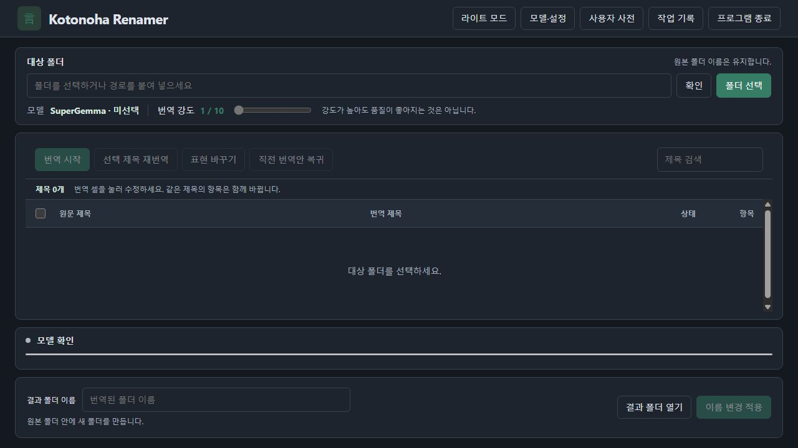

# Kotonoha Renamer

**v1.0.0 · Windows용 포터블 번역 GUI**

일본어 파일·폴더 이름을 로컬 AI로 한국어로 번역합니다. EXE를 실행하면 기본 브라우저에 작업 화면이 열립니다. Python 설치나 Kotonoha 설치 마법사는 필요 없습니다.

터미널 명령으로 사용하려면 [Kotonoha Renamer CLI](https://github.com/lshlabs/kotonoha-renamer-cli)를 이용하세요. 두 버전은 별도 실행·배포하며, 이 저장소는 GUI 포터블만 제공합니다.



## 실행

1. 포터블 ZIP을 쓰기 가능한 폴더에 압축 해제합니다.
2. `Kotonoha.exe`를 실행합니다.
3. 브라우저에서 대상 폴더를 선택하고 번역안을 확인합니다.
4. 필요한 제목을 수정한 뒤 **이름 변경 적용**을 누릅니다.

`Kotonoha.exe`와 `_internal` 폴더를 함께 유지하세요. 관리자 권한이나 PATH 등록은 필요 없습니다. 서버는 자신의 컴퓨터에서만 접속할 수 있는 `localhost`의 빈 포트를 사용합니다.

대상 폴더 이름은 유지합니다. 번역 이름의 하위 폴더를 만들고 내용물을 그 안으로 이동합니다. 파일 내용·확장자·트랙 번호는 보존합니다.

```text
원본 폴더/
  번역된 폴더 이름/
    번역된 파일·폴더
  rename-log.json
```

## 번역과 모델

- 번역 셀을 직접 수정하거나 체크한 제목만 다시 번역할 수 있습니다.
- **표현 바꾸기**는 현재 번역에서 일치하는 텍스트만 치환합니다. 선택한 제목이 없으면 전체에서 찾으며 AI를 호출하지 않습니다.
- **사용자 사전**에서 모든 폴더에 참고할 원문 표현과 원하는 한국어를 저장합니다.
- 기본 화면은 다크모드이며, 상단 버튼으로 테마를 전환할 수 있습니다.
- 이미 적용한 폴더도 기존 결과 폴더에서 수정한 이름만 다시 적용할 수 있습니다.
- 후보 채택은 번역안만 바꿉니다. 파일 변경은 별도의 적용 확인 후 진행합니다.
- 번역 강도는 1~10이며, 높다고 품질이 좋아지는 것은 아닙니다.
- **모델·설정**에서 SuperGemma 설치·기본 모델 변경·삭제를 처리합니다. 모델 다운로드 성공 후 해당 모델이 기본으로 설정됩니다.
- 번역·재번역 종료 후 선택 모델의 메모리 해제를 요청하고 상태를 표시합니다.

Ollama와 모델은 별도로 필요합니다. 기존 Ollama를 사용할 수 있고 화면에서 설치·업데이트할 수도 있습니다. Kotonoha 포터블에 Ollama나 모델이 포함된 것은 아닙니다.

## 종료·복구·데이터

**프로그램 종료**를 누르면 서버를 종료합니다. 진행 중이라면 중단·기록 정리가 끝난 뒤 종료합니다. 브라우저 탭만 닫으면 서버는 유지되며, EXE를 다시 실행하면 같은 작업 화면이 열립니다.

**작업 기록**에서 중단된 이동을 계속하거나 원래 이름·위치로 복구합니다. 복구 로그를 유지하세요. 대상 폴더 자체의 잠금은 피하지만 개별 파일·하위 폴더 잠금은 여전히 해당 프로그램을 닫아야 합니다.

설정·사용자 사전·캐시·외부 복구 저널은 EXE 옆 `data`에 저장합니다. 포터블을 옮길 때 이 폴더도 함께 옮기세요. 이전 설치판의 `%LOCALAPPDATA%\Kotonoha` 자료는 자동으로 옮기지 않습니다.

## 개발

```powershell
python -m pip install -r requirements-build.txt
python -m unittest discover
python kotonoha_gui.py
.\build.ps1 -Python python
```

개발 실행도 프로젝트의 `data`를 사용합니다. `KOTONOHA_DATA_DIR`로 테스트 데이터를 분리할 수 있습니다.

현재 버전은 `1.0.0`입니다. 저장소 이름은 **kotonoha-renamer**이며, 배포 파일은 [GitHub Releases](https://github.com/lshlabs/kotonoha-renamer/releases)에서 제공합니다. 검증 범위는 [검증 보고서](docs/validation.md), 상세 사용법은 [사용 안내](docs/usage.md)를 참고하세요.

## 저장소 구성

- `gui/`: 브라우저 화면
- `kotonoha_*.py`: GUI 실행·번역·파일 작업 엔진
- `resources/`: Ollama 설치 파일 서명 검증
- `tests/`: 자동 테스트
- `scripts/`, `kotonoha.spec`, `build.ps1`: 포터블 빌드·패키징
- `docs/`: 사용법·검증·배포 안내

빌드 결과는 Git에서 제외한 `dist/`에 생성됩니다. 배포 시 `kotonoha-renamer-v<버전>-windows-x64.zip`과 `SHA256SUMS-v<버전>.txt`를 GitHub Release에 첨부하세요. 개인 설정·사전·캐시·복구 기록이 들어 있는 `data/`는 커밋하거나 배포하지 않습니다.
